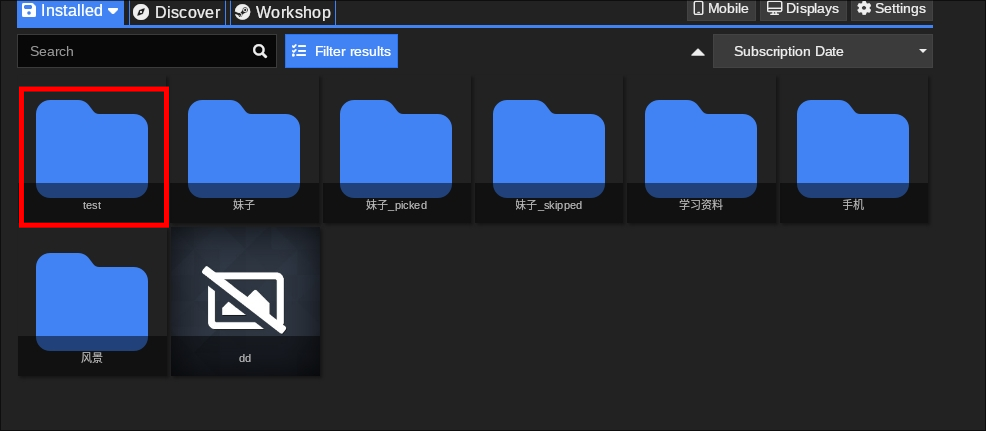
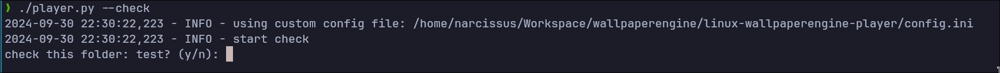
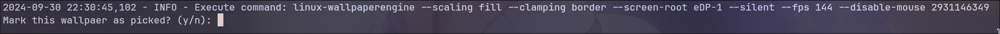
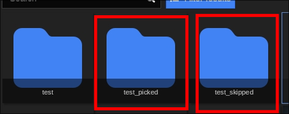
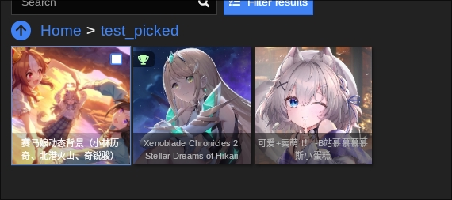
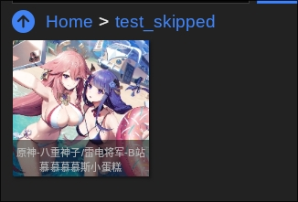
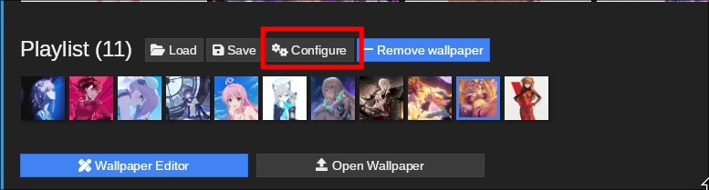
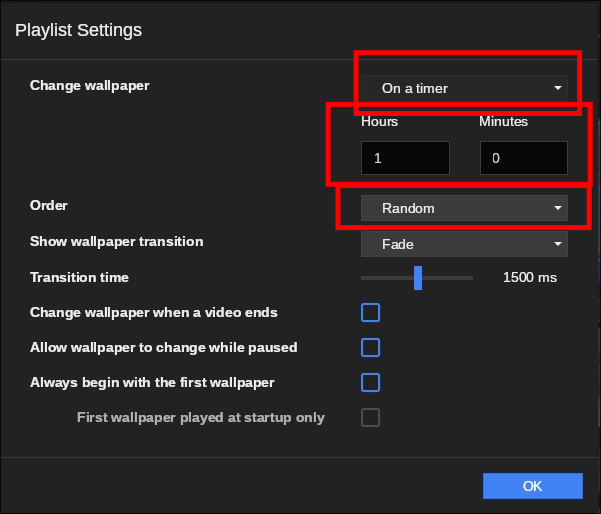
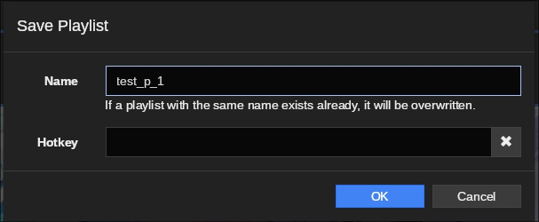

# linux-wallpaperengine-player

A script tool for playing and checking live wallpapers with wallpaperengine and linux-wallpaperengine.

## Features

- Pick and play a single wallpaper using Wallpaper Engine's UI.
- Batch check wallpapers using Wallpaper Engine's folders.
- Play wallpapers using a playlist.

## Requirement

- linux-wallpaperengine
- Steam(Linux)
- wallpaperengine on Steam
- run wallpaperengine using proton
- Python >= 3.12

## Installation

Clone this repo, and just run using Python

```bash
    git clone https://github.com/DI-HUO-MING-YI/linux-wallpaperengine-player.git
    cd linux-wallpaperengine-player
    ./player.py --help

```

## Usage

- ### Pick and play a single wallpaper using Wallpaper Engine's UI.

1. open the wallpaperengine UI, pick a wallpaper and click Displays
   
   **_\*Now only one display is supported, multi displays supporting is comming soon._**
2. save as a profile with the name test_m_1
   
   
3. run player.py to start display wallpaper

```bash
./player.py --watch --profile test_m_1
```

4. the wallpaper will display now.
5. you can pick a new wallpaper and save profile with the same name.
6. wait 1 scond, and new wallpaper will replace the last one.

- ### Batch check wallpapers using Wallpaper Engine's folders.

1. create a new folder named test, and put wallpapers that you want to check.
   
   #### NOTE:
   **_\* MUST CLOSE THE WALLPAPER ENGINE_**  
   **_\* It is recommend to close it using Steam stop function_**
2. run player.py to batch check. chose which fold to check, and play wallpapers one by one.
   
   

   #### NOTE:

   **_\* folders named with suffix "\_piecked" and "\_skipped" will not be checked_**  
   **_\* type y / n to check a wallpaper, if y , the wallpaper will be moved to a new folder named test_picked_**  
   **_\* if n, the wallpaper will be moved to a new folder named test_skipped_**  
   **_\* if type nothing and just press enter, the wallpaper will not be moved_**

3. test_skipped and test_picked will be created and wallpapers will be moved to them by your choise.
   
   
   

- ### Play wallpapers using a playlist.

1. open the wallpaperengine UI, pick some wallpapers and add to playlist, then click Configure.
   
2. set playlist settings, not all settings is available, but they are comming soon.

   **only timer play mode is available now, and you can set times now**  
   **Oreder is also supported now**
   

3. save as a playlist with the name test_p_1
   
   
4. run player.py to start display wallpapers using playlist seetings

```bash
./player.py --play --playlist test_p_1
```

4. the wallpaper will display now.
5. you can pick some wallpapers and save playlist with the same name.
6. rerun player.py to apply new playlist settings.  
   **_\*auto rerun is comming soon_**

## Configration

## Roadmap

## NOTE: I only test this tool on Archlinux with Hyprland.

## If you have any questions, just post an issue.
