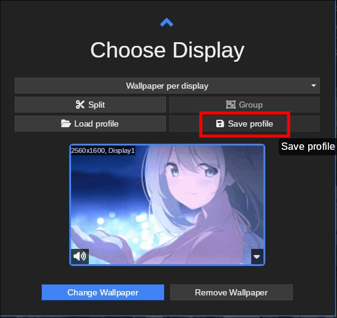

# linux-wallpaperengine-player

A script tool for playing and checking live wallpapers with wallpaperengine and linux-wallpaperengine.

## Features

- Pick and play a single wallpaper using Wallpaper Engine's UI.
- Batch check wallpapers using Wallpaper Engine's folders.
- Play wallpapers using a playlist.

## Requirement

- linux-wallpaperengine
- Steam(Linux)
- wallpaperengine on Steam
- run wallpaperengine using proton
- Python >= 3.12

## Installation

Clone this repo, and just run using Python

```bash
    git clone https://github.com/DI-HUO-MING-YI/linux-wallpaperengine-player.git
    cd linux-wallpaperengine-player
    ./player.py --help

```

## Usage

- ### Pick and play a single wallpaper using Wallpaper Engine's UI.

1. open the wallpaperengine UI, pick a wallpaper and click Displays
   
   **\* Now only one display is supported, multi displays supporting is comming sone.**
2. save as a profile with the name test_m_1
   
   
3. run player.py to start display wallpaper

```bash
./player.py --watch --profile test_m_1
```

4. the wallpaper will display now.
5. you can pick a new wallpaper and save profile with the same name.
6. wait 1 scond, and new wallpaper will replace the last one.

- ### Batch check wallpapers using Wallpaper Engine's folders.
- ### Play wallpapers using a playlist.
